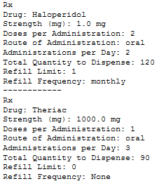
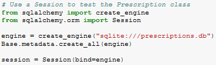
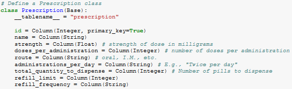

### 1. Students Do: Prescriptions Warm-Up (0:15)

* In this activity, students will be crafting a SQLAlchemy class for prescriptions. They will then have to create a connection to a SQLite database and push some data up to the server.

  

* **Instructions**:

  * Your tasks for this activity are to use the SQLAlchemy ORM to define a `Prescription` class and then use a `session` to commit prescription data to a local SQLite database.

  * Start by writing the necessary imports and starter code for SQLAlchemy scripts.

  * The `Prescription` class should keep track of the following information:

    * The **name** of the drug the script is for. E.g.: `"Amoxicillin"`

    * The **strength** of each dose in milligrams. E.g.: `25.5`

    * The number of **doses per administration**. This is the "number of pills" a patient would take at each administration of the drug.

    * The **route of administration**. E.g.: `"Oral"`, `"Intravenous"`, etc.

    * The number of **administrations per day**. This is how many times the patient is to take the drug over the course of the day. E.g.: `"Twice daily"`.

    * The **total quantity to dispense**. This is the total number of pills/volume of solution the pharmacist filling the prescription is supposed to dispense. E.g: `"120"`.

    * The **refill limit**. This is the number of times the patient can use this prescription. E.g.: `3`.

    * The **refill frequency**. This is the frequency with which the patient can seek refills. E.g.: `"Monthly"`.

  * Once you've created your `Prescription` class, instantiate it and use a `session` to save the new instance to the database.

* **Hints**:

  * For help creating the `Prescription` class, refer to the documentation on [Declaring a Mapping](http://docs.sqlalchemy.org/en/latest/orm/tutorial.html#declare-a-mapping).

  * For help interacting with the database, refer to the documentation on [Creating a Session](http://docs.sqlalchemy.org/en/latest/orm/tutorial.html#creating-a-session).

### 2. Everyone Do: Review Prescriptions (0:05)

* Open up the solution in [Activities/01-Stu_Prescriptions/Solved](Activities/01-Stu_Prescriptions/Solved/Stu_Prescriptions.ipynb), going through the code line-by-line and explaining the points below.

  * Point out how this solution is using a SQLite database instead of a MySQL database. These kinds of databases are stored within the computer's file system and, as such, can be referenced simply by referring to a relative path. Students should feel free to use these kinds of files whenever they so desire and some future activities will deal with them as well.

    

  * Remind students that ORM classes must have the following four properties. They must extend an instance of the declarative `Base` class, have a `__tablename__` property, have one or more `Column` attributes, have a column defined as the table's `primary_key`.

  * Briefly review each of the columns defined within the `Prescription` class and emphasize the presence of `primary_key=True` on the `id` column.

    

  * Take a moment to remind students how to use a `session` object to add and commit `Prescription` objects to the database.

  * Point out that, while this class fully describes what a pharmacist should dispense, it does _not_ allow users to associate prescriptions with particular patients.

  * Point out how the queries are being made at the bottom of the application. By using the `fiter_by()` method, SQLAlchemy developers can create more complex queries to SQL databases. This will be discussed in more detail during the next activity.
