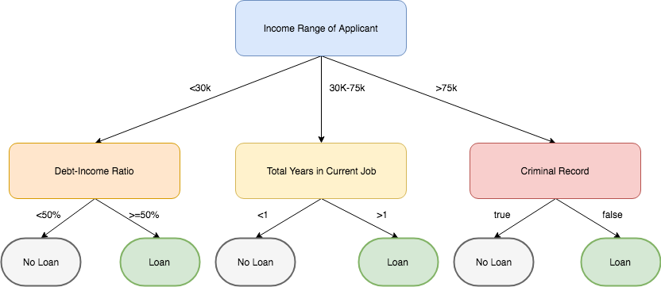
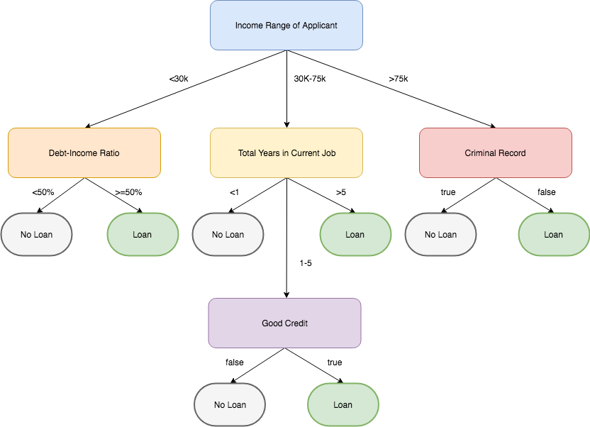

# JavaScript Loan Approver

In this activity, you will use JavaScript to make a loan decision for a variety of conditions.

## Instructions

* Use the starter files and complete the logic to calculate a loan decision.

* Use the decision tree above to code the JavaScript conditional statements needed to make a loan decision.

## BONUS

* Use the advanced decision tree and write the logic to make a loan decision.

  

## HINTS

* Start at the top of the tree and write the `if, else if, else` statement for income level. Then, fill in each of those with the `if, else` statements needed for the final decisions.

* Consider writing the code in Python first and then translate it to JavaScript.

* If time allows, begin looking into how a ternary operator works in JavaScript: [https://developer.mozilla.org/en-US/docs/Web/JavaScript/Reference/Operators/Conditional_Operator](https://developer.mozilla.org/en-US/docs/Web/JavaScript/Reference/Operators/Conditional_Operator).
