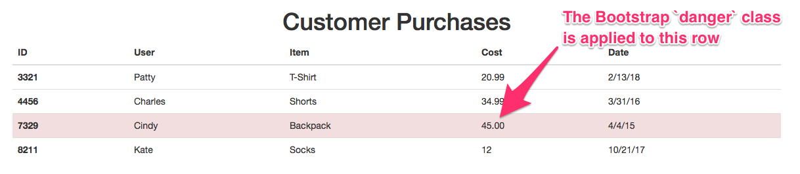

# Extra Content Lesson Plan

### 1. Students Do: Refactored Word Counter (15 mins)

* **Files**

  * [Activities/Extra-Stu_Refactor_Word_Counter/README.md](Activities/Extra-Stu_Refactor_Word_Counter/README.md)

### 2. Instructor Do: Review Word Counter Refactored (5 mins)

* Explain that the syntax of an arrow function is slightly different from before:

  ```js
  var wordCount = (myString) => {};
  ```

  * There is no `function` keyword.

  * There is a fat arrow between the parentheses containing a function's parameter(s), and the curly braces containing the function body.

* Also go over using the `forEach()` method in lieu of a for-loop:

  ```js
  stringArray.forEach(currentWord => {});
  ```

  * The `forEach()` method loops over each element in `stringArray`.

  * The code in the curly braces is executed for each element in the array, arbitrarily named `currentWord` in this example.

* Take a moment to bask collectively in the elegance of functional programming syntax!

### 3. Students Do: HTML Table (10 mins) (Low)

* **Files:**

  * [Activities/Extra-Stu_HTML_Table/README.md](Activities/Extra-Stu_HTML_Table/README.md)

  * [Activities/Extra-Stu_HTML_Table/Resources/userData.csv](Activities/Extra-Stu_HTML_Table/Resources/userData.csv)

### 4. Instructor Do: Review Student HTML table (5 mins) (Low)

* Open [Activities/Extra-Stu_HTML_Table/Solved/index.html](Activities/Extra-Stu_HTML_Table/Solved/index.html) in an editor and highlight the following:

  

  * The `table` tag is modified to use the Bootstrap `table-hover` class.

  * The `danger` class is applied to the row where the cost is above 40.
