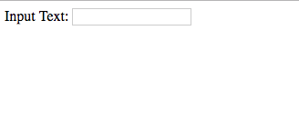

# Reverse a String

In this activity, you will use d3 to reverse the input text and display it on the page.

## Instructions

* Use d3 to select the input (`#text`) and output (`.output`) elements from the page.

* Use d3 to attach an event listener to the input field. This event should call the `handleChange` function any time that the input text changes.

* Finally, complete the `handleChange` function to select the text from the input field and reverse the string. This function will use d3 to set the output element to the value of the reversed string.

## Bonus

* Instead of reversing the string, try to calculate the number of characters in the string.

* Edit the `index.html` file to change the `h1` tag to an unordered list `ul`. Append each `word: count` as a `li` element.

* Hint: You may need to iterate through the object using `Object.entries` and `forEach`. You can find examples [here](https://developer.mozilla.org/en-US/docs/Web/JavaScript/Reference/Global_Objects/Object/entries).
