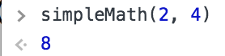

# JavaScript Reference Guide


## Background & Purpose

_What is JavaScript and where is it used?_

When paired with HTML and CSS, JavaScript is a programming language that allows developers to add complexity and interactivity (such as animation or dynamic updates) to websites.

This guide contains several of the core concepts used in JavaScript: `functions`, `loops`, `conditional statements`, and `objects`.

- - -

### Functions

Functions in JavaScript are designed for certain tasks and are executed when called.

They are defined by the `function` keyword, followed by the function name, and completed with parentheses. Parameters may be included within the parentheses, separated by commas. The code executed when the function is called is placed within curly brackets.

```js
function simpleMath(n, m) {
    return n * m;
}
```

In the above example, the function has been named `simpleMath` and it accepts two parameters. When called, it will return the product of the parameters.



**Note**: JavaScript styling guidelines recommend four spaces when indenting code blocks and camelCase when naming variables and functions.

- - -

### Loops

A `for` loop in every programming language works the same way, but the syntax will vary:

```js
for (i = 0; i < 10; i++) {
    console.log("Loop ", i);
}
```

In the above example, the loop begins with the keyword `for`, followed by parentheses with three statements and a set of curly brackets.

1. The variable `i` is declared and set to a starting point, followed by a semicolon.

2. In the second statement, `i` is told to keep looping while the value is less than 10, also followed by a semicolon.

3. With the third statement, the loop is telling `i` to increase by one each time through.

4. The curly brackets contain the code that will be affected by the `for` loop.

After running this `for loop` in an IDE or your console, the numbers 0 through 9 are output.

**Looping through arrays** is similar, but the loop will only run while it is less than the length of the array.

**Hint**: An `array` is similar to a Python `list`.

```js
var students = ["Johnny", "Tyler", "Bodhi", "Pappas"];

for (var i = 0; i < students.length; i++) {
    console.log(students[i]);
}
```

After executing the above `for loop`, each student's name is printed on a new line in the console:

```output
Johnny
Tyler
Bodhi
Pappas
```

- - -

### Conditional Statements

`Conditional Statements` in Python and Javascript are similar; the main differences lie in syntax.

When checking for two conditions, JavaScript utilizes a pair of ampersands (`&&`) instead of the Pythonic keyword `and`:

```js
if(x == 10 && y == 15) {
  console.log("Both values returned true");
}
```

To check if either condition is met in JavaScript, two pipes (`||`) are used instead of the Python keyword `or`:

```js
if(x > 100 || y > 35 ) {
  console.log("One or the other statement is true");
}
```

`Nested conditionals` in JavaScript are laid out similarly to Python's, but each block of code is wrapped within a new set of curly brackets.

`if` is used to specify a block of code to run if a condition is met:

```js
if (x < 10) {
  console.log("x is greater than 10");
}
```

`else` is used when the original `if` statement is false:

```js
if (x < 10) {
  console.log("x is less than 10");
} else {
  console.log("x is greater than 10");
}
```

`else if` will specify a new condition if the first condition is false:

```js
if (x < 10) {
    console.log("x is less than 10");
} else if (x < 20) {
    console.log("x is greater than 10, but less than 20");
} else {
    console.log("x is greater than 20");
}
```

### Objects

An object is a variable that can contain many values, similar to a Python dictionary:

```js
var games = {
    name: "Settlers of Catan",
    type: "tabletop",
    minPlayers: 2,
    maxPlayers: 4
};
```

Retrieving values, or properties, from the object uses dot notation. For example: `console.log(games.name)` will return "Settlers of Catan" from the above object.

- - -
